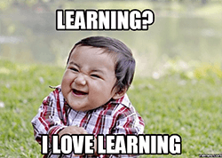
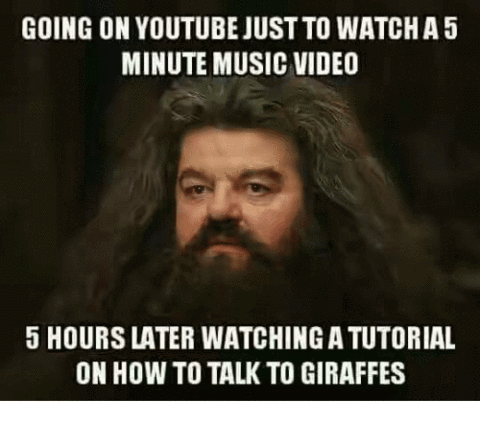
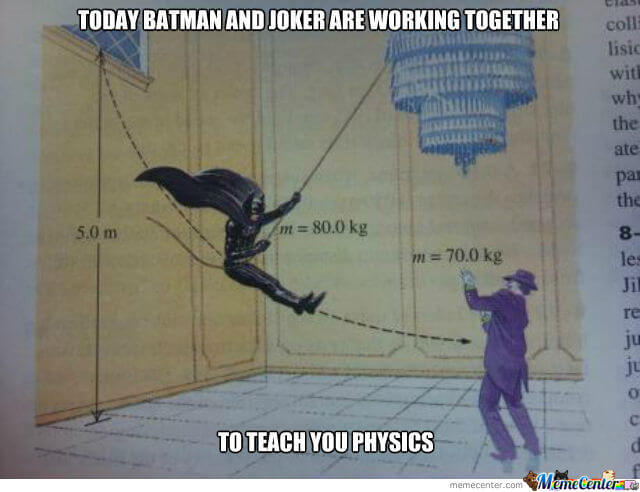
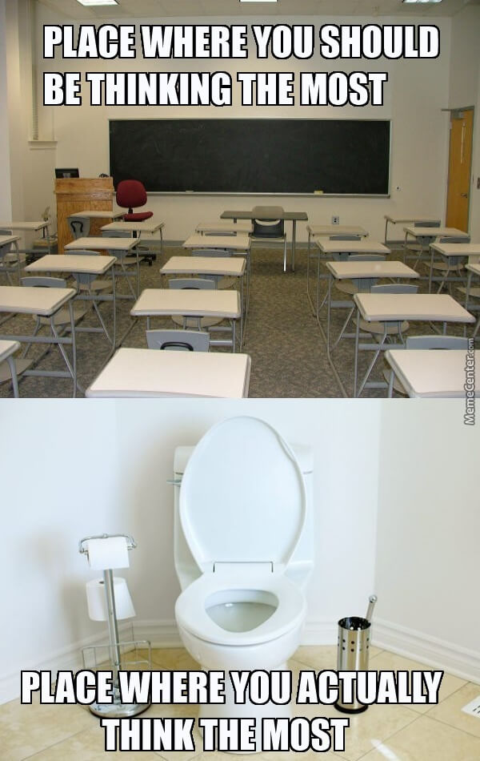

In this blog post, I will be summarizing the wonderful and enlightening online couse [Learning How To Learn](https://www.coursera.org/learn/learning-how-to-learn).  
This course contains research-backed insights and techniques to improve your learning and thinking prowess, enabling you to understand anything better and faster.  

Here are the key actionable points that I have summarized from the video lectures and the optional readings:  

 - **Focused vs Diffused mode**: Whenever you are focusing on something to understand/create new ideas and are not able to progress, sometimes it helps to relax and go for a walk to turn on the `diffuse` mode. Maybe the idea will occur to your subconscious mind.
 - **Anti-Procrastination techniques**  
     
   This has been especially useful to me considering me serial procrastinator background.
   - `Pomodoro` -> 25 mins work + 5 mins break = 1 session. Because attention span is short.
   - `20 second rule` -> Just focus and do the first smallest step of the task (which probably takes seconds).
   - `3 second rule` -> If feeling afraid/lazy to do some action, count to 3 and do it anyway.
   - `Mindfulness` -> Be aware of the `cues` (location/time/feelings) that lead you astray.
   
 - While studying, write down question related to the content. After finishing, try to answer them.
 - Make notes/summary! Very important!
 - **30 second rule**: After a lecture/reading, write down the summary of the most important stuff `in your own words` in exactly 30 seconds (no less, no more!).
 - Recall after reading a page. Test yourself regularly. Spaced repetition.
 - Break problem into individual small tasks.
 - Writing creates stronger neural patterns than typing.
 - Write an explanation of the topic assuming it would be read by a 10 year old.  
   
 - Do the hardest thing first!
 - **Motivation**: Always remind yourself of the objective for your effort. Whether it be college admission, getting a good job, good life etc.
 - Use **visual imagery**: Our brain is able to remember visual impressions much more easily than textual data due to evolution. So, use *memory palaces* and ridiculous/funny/memorable visuals for an equation/concept!
   
 - Don't highlight text!
 - Don't do passive reading!
 - Don't solve the same types of problems repeatedly. Solve one type of problem from one topic; then move to next type.
   This is called as `Interleaved` rather than `Massed` learning.
 - `Einstellung problem`: Don’t always trust your initial intuition. An idea or a neural pattern you developed might prevent a new better idea from being found. Sometimes your initial intuition is wrong. You need to unlearn old ideas and approaches before you learn new ones.
 - Read the textbook before attending the lecture.
 - Sleep, diet and `exercise`!! Exercise is better than any drug on the market for your brain. 
 - Practice makes perfect; but follow Pomodoro religiously!
 - Creativity is more probable in a group setting, but make sure that too much time is not getting wasted in gossip.
   
 - Success in life comes from persistence, not from intelligence.
 - Short term memory is just 5-8 chunks(concepts). But the content in those chunks can get bigger.
 - While learning a language, its okay to make mistakes; practice with someone anyways!
 - Get out of your comfort zone. When you feel uncomfortable, that is when changes are physically being done to brain!
 - Non-agreeable people are found to be more creative.
 - 3 `Neuromodulators`:
   - *Acetylcholine* - Focus, learning.
   - *Dopamine* - Motivation, reward system -> Might fool you/counterproductive (eg drugs). -> Parkinsons
   - *Serotonin* - Social activity, inversely related to risk taking.
 - `Law of Serendipity`/`Lady luck favours those who try` -> It gets easier as you do it.
 - Do not be afraid of trying/practicing the hard stuff!
 - *Increase `Luck`*:
   - Follow your intuitions sometimes rather than always being rational.
   - Dont be too rigid and follow a strict routine. Be random (Before a party, think of a color and then start conversations with people wearing that colour.)  
     
   - Always see the positive side of life.
 - Multitasking is evil!
 - Habit is an energy-saver -> Use the zombie mindset to your advantage.
 - Focus on the process rather than the product.
 - Write lists of tasks for the next day before sleeping. It tends to register into your subconscious mind.
 - Planning your quitting time is as important as planning your working time.
 - While learning a new concept/language, it might happen that the new language suddenly might seem to be completely indecipherable. But this is fairly normal and will get back to normal ultimately. It happens because the brain is restructuring.
 - Imagine that you are understanding yourself (Imagine you are an electron revolving around the nucleus).
 - A good memory might inhibit you from becoming creative.
 - Try to recall concepts in different physical locations/contexts so that the concept isn't associated/hardwired just to that location.
   
 - Teenagers are more impulsive because the area of the brain that influences will power is not completely formed until the early 20s.
   
 - Friends can act as a validator/devil's advocate to verify your solutions to a new problem.
 - Before a test, go through the Richard Felder checklist.
 - On a test, first read all the questions. Then start with the hardest problems. If stuck, then switch to the easy problems and then back to the difficult ones. The reason is that switching away from the hard problem will trigger the diffuse mode which might lead to the answer popping in your subconscious mind later.
 - On the day of the test, take it easy; just attempt the test in a non-serious curious playful attitude.
   
 - To avoid old-age memory problems like *Alzheimers*, be a polymath and just keep learning something new (crosswords and puzzles dont count!).
   
 - The more curious you are about something, the better you'll learn.
 - You are the average of of your friends.
 - Short-term stress is actually optimal for learning, but long term is bad.
 - `Humanities` = Everything - `Natural Sciences` - `Hard Social Sciences` - Math  
   - `Natural Sciences` = Physics, Maths, Chemistry, Astronomy etc.  
   - `Hard Social Sciences` = Psychology, Sociology  
   - `Humanities` = Philosophy, Theology, Literature, History, Archeology, Music  
 - Be aware of Imposter Syndrome.
 - Write down what is puzzling you. `I am confused about X` / `I am confused about how X relates to Y`.
 - While writing/speaking:
   - Think objects, not ideas. Dont let it be too abstract. Prevent too many words ending with *-ion*/*-tion*. An object    is something you can touch. An abstraction is an intangible (eg. nation, conversation).
    If you present an abstract idea, make sure to provide enough concrete examples.
   - When talking about tangible things that are too small/big (electrons/galaxies), use metaphors.
   - Use short *precise* words and sentences with easy language. Dont get tempted to impress with obscure words.
   - Just randomly write down whatever comes to your mind. This is called *mindmapping*, which helps you engage your diffuse mode. After that, use focussed mode to extrapolate/edit that. 
   - Also, dont try to edit during the mindmapping phase. Just dont hit the backspace key!!
   - Before publishing, check:  
     - Is it clear enough?  
     - Is everything covered?

*Studies show that readers are more likely to believe articles related to the brain if there is an actual photo of the brain present somewhere.